# RenderStack

RenderStack brings modern media embedding to FakeStackOverflow, most notably through a native 3D model viewport that lets users upload, view, and interact with 3D assets directly in the browser. It also introduces a community-driven gallery for showcasing work, along with expanded profile customization that allows users to build dynamic, portfolio-style pages. Together, these features elevate the platform from a traditional Q&A site into a collaborative hub for creative problem-solving, inspiration, and professional expression in software development, graphics, and 3D art.

View RenderStack here: https://cs4530-f25-201.onrender.com/home

## Feature Overview

### 3D Viewport

The 3D Viewport supports GLB file uploads, enabling users to explore models directly through mouse-driven orbit controls (panning, tilting, rotating, zooming). This allows users to freely rotate and inspect 3D assets in detail within the browser.

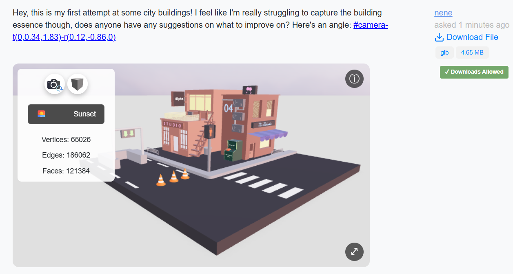

### Questions

The New Question Form has expanded to include media uploads (YouTube/Vimeo links, image, video, and GLB). Drag-and-drop is also included for seamless uploading. Only one file is allowed per question post. If users upload a 3D model, they have the option to allow others to download their model file from the question post.

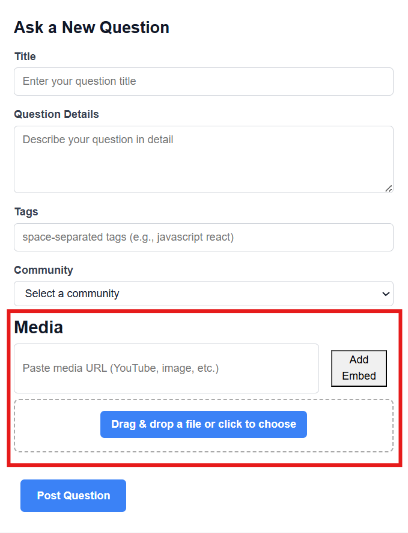

The New Question form also supports adding camera references. This can be done by interacting with the 3D model via orbit controls and then clicking “Add Camera Reference” to append the reference to the question detail. The camera reference appears as a clickable link once the question is posted. When clicked, the viewport scene and camera snap to the correct position.

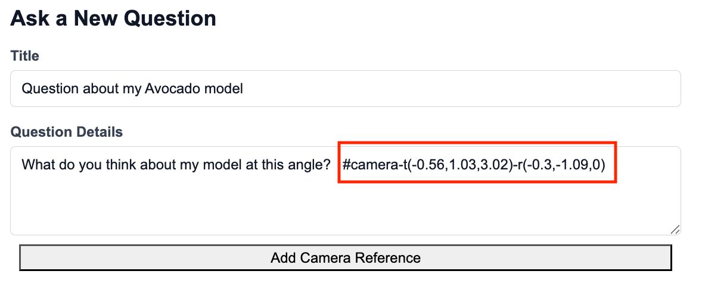
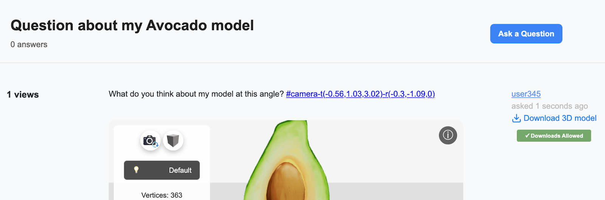

### Answers

Answers also support camera references. The 3D model media in question can be interacted with via orbit controls and when “Answer Question” is clicked, an option to “Add Camera Reference” appears. 

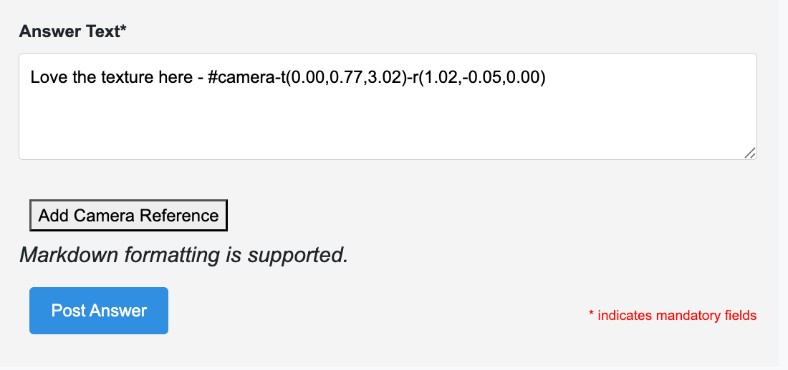

### Comments

Under question posts, users can similarly leave comments with embedded media with drag-and-drop support. Similar to questions, if users choose to upload a 3D model file, they can choose whether or not to give permission to other users to download their model. For posters of question posts and comments that contain model files, they will see a button by their post that allows them to toggle download permissions on said file even after they post.

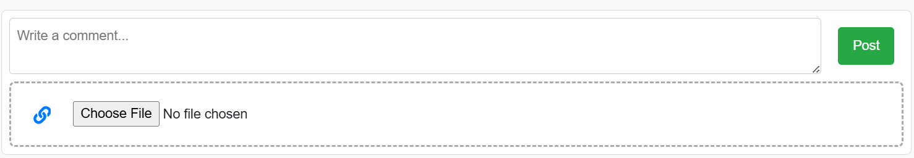
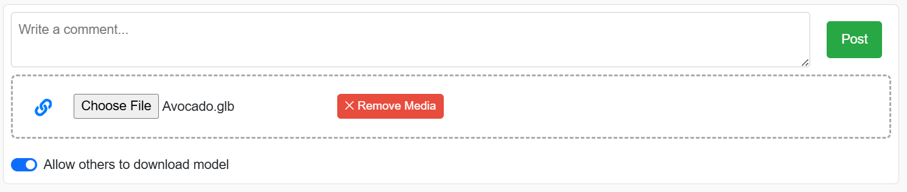

### Community Gallery

The community gallery is an added feature of the community page, displaying projects with media content uploaded by users of that community.

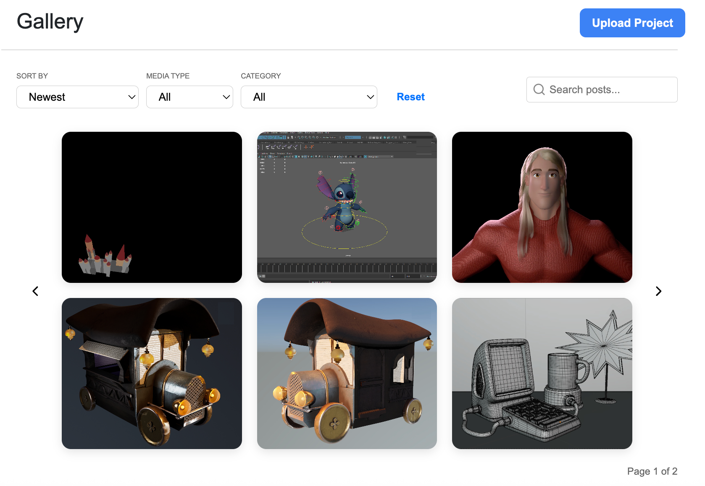
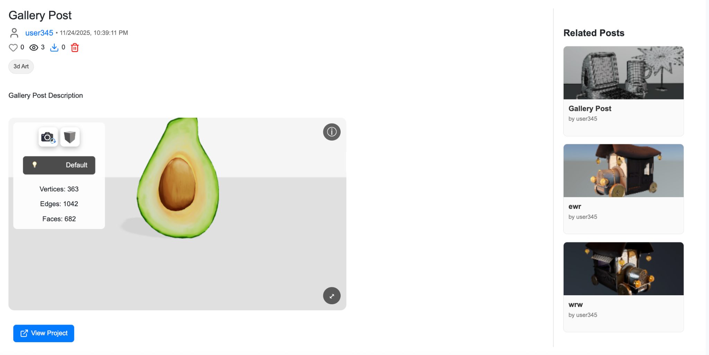

### User Profiles

RenderStack’s enhanced user profile system improves basic user accounts into comprehensive professional portfolios. With the improved user profile functionality, users can better share their work, showcase their skills, and show off their artistic identity. 

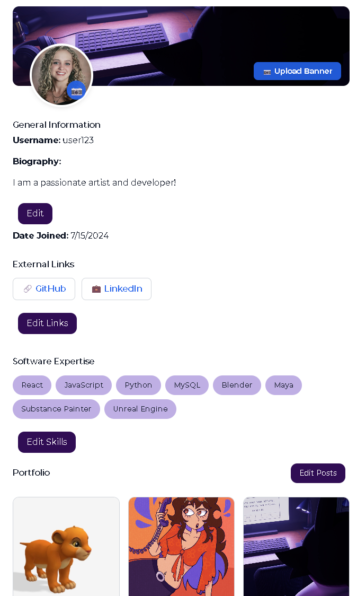

## Database Architecture

The schemas for the database are documented in the directory `server/models/schema`.
A class diagram for the schema definition is shown below:

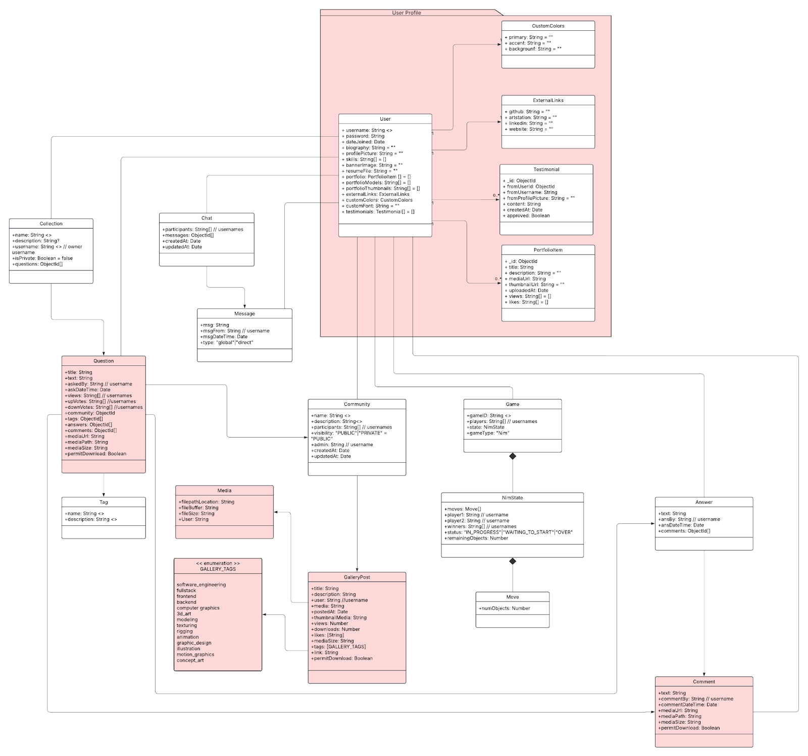
